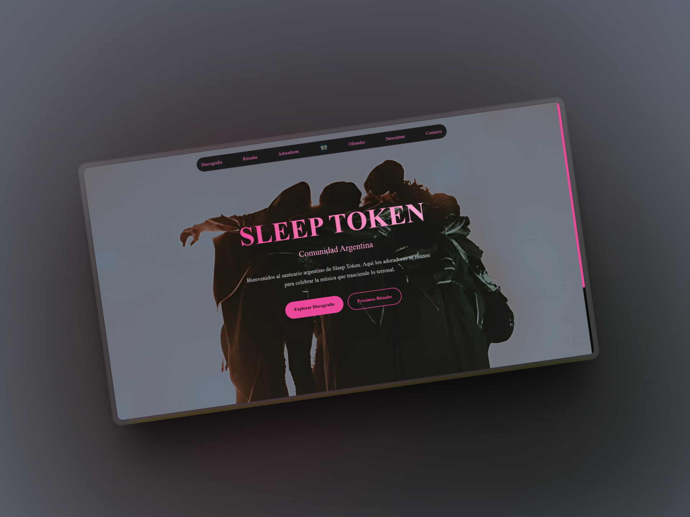

# Sleep Token — Comunidad Argentina

Bienvenidos al santuario argentino de **Sleep Token**.
Un espacio creado para honrar la música, los rituales y el misterio que rodea a esta banda única.

🌑 Este sitio es una plataforma de encuentro para los **adoradores** de Sleep Token en Argentina. Aquí podrás explorar la discografía, sumarte a rituales, unirte a nuestra newsletter y formar parte de una comunidad que trasciende lo convencional.

---

## 🚀 Sitio en Producción

👉 [https://official-sleep-token-arg-page.vercel.app/](https://official-sleep-token-arg-page.vercel.app/)

---

## 📌 Secciones destacadas

- **Discografía**: Recorre los lanzamientos de Sleep Token desde sus inicios hasta lo último.
- **Rituales**: Participá en eventos y ceremonias online u offline dedicadas a la banda.
- **Adoradores**: Unite al registro de fans y seguidores de la comunidad.
- **Ofrecidas**: Espacio para aportes creativos, fan art y proyectos relacionados.
- **Newsletter**: Recibí novedades exclusivas, rituales y noticias por correo.
- **Contacto**: Dejanos tus mensajes, ideas o colaboraciones.

---

## 🧪 Stack Tecnológico

- **Framework**: [Astro](https://astro.build/) (o el que estés usando si es otro)
- **Despliegue**: [Vercel](https://vercel.com/)
- **Estilos**: CSS personalizado, con foco en estética oscura y acentos neón

---

## 🖤 Créditos

Este sitio fue creado por fans y para fans, sin fines comerciales.
Sleep Token pertenece a sus respectivos autores y esta es una iniciativa de tributo.

---

## 🤝 Contribuciones

¿Querés sumar contenido o colaborar con el proyecto?
Abrí un issue o mandá un pull request. ¡Toda ayuda es bienvenida!

---

## ⚠️ Licencia

Este sitio está bajo la [Licencia MIT](./LICENSE), pero por respeto a los derechos de autor, no se permite la monetización del contenido oficial de la banda.

